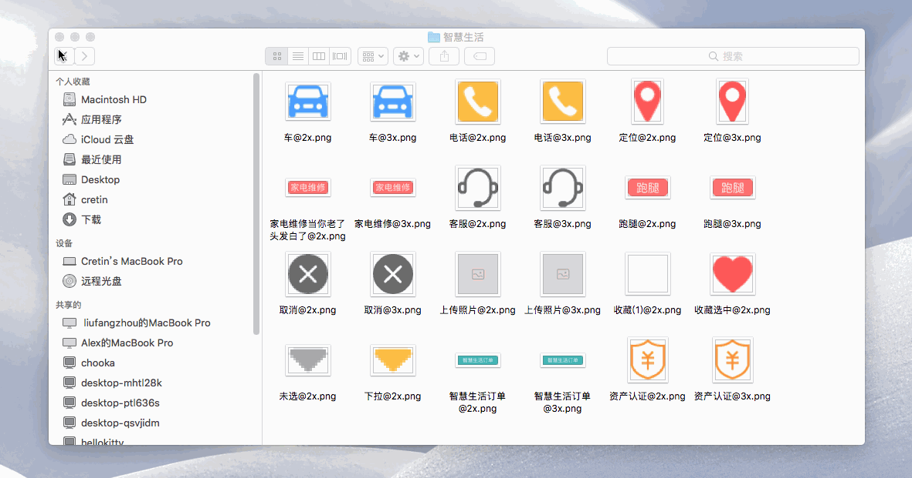

# FileBatchModification
Android资源文件批量分类处理 具体使用请看博客

[【为生活开发系列之三】Android屏幕适配资源文件批量分类工具](https://www.jianshu.com/p/3fafe858b354)

### 更新
+ 2019-05-19 21:35:09 更新

  新增对文件名中特殊字符进行替换的功能，比如Android资源文件不能有大写字母，就可以开启大写转换的功能。

+ 2018-10-10 14:30:36 更新

```
一、 新增对中文文件名进行英文翻译的功能
二、 新增仅对文件名进行翻译的功能
三、 新增对新生成文件名长度的设置功能
```

+ 2018-10-09 23:42:00 新增功能，对于有些很懒的UI，切图会有中文，Android开发资源文件不能有中文，所以添加一个自动将中文变成拼音的功能

### 下载jar包体验

[jar下载](https://raw.githubusercontent.com/MZCretin/FileBatchModification/master/文件批量处理最新V1.1.jar)

### 效果图

